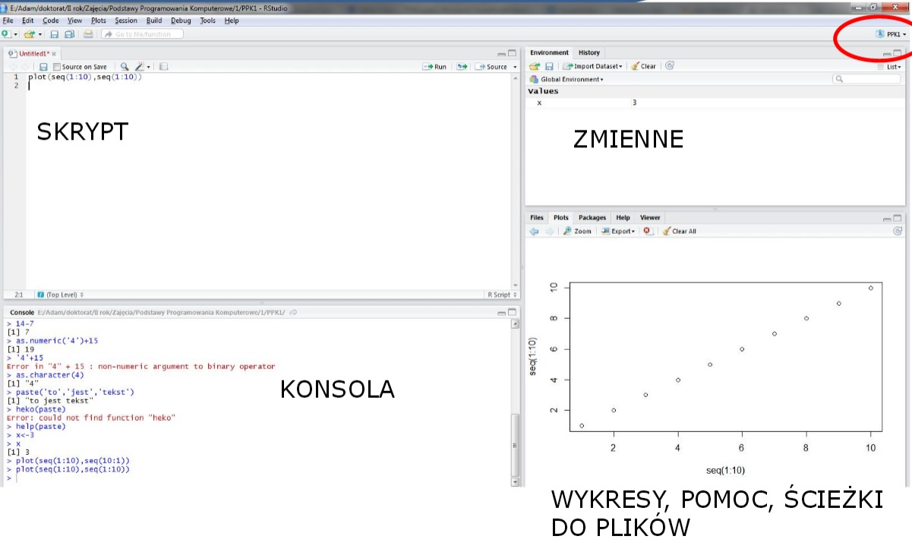
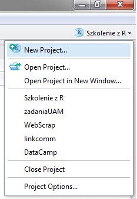
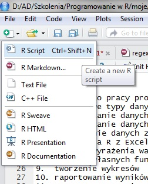

```{r global_options, include=FALSE}
knitr::opts_chunk$set(fig.width=12, fig.height=8, fig.path='images/',
                       warning=FALSE, message=FALSE,error=F,echo=T)
```

##Zakres tematyczny

1. Środowisko RStudio
2. Podstawowe typy danych
3. Zmienne
4. Działania arytmetyczne
5. Działania logiczne
6. Wektory
7. Rzutowanie typów danych
8. Wykorzystywanie funkcji
9. Operatory logiczne
10. Symbole nieoznaczone
11. Dane tabelaryczne
12. Selekcja danych

##R
 
 - R jest młodym, interpretowanym językiem programowania powstałym w latach '90.
 - Zostłał stworzony i jest rozwijany przede wszystkim do analizy i wizualizacji danych
 - Obecnie może być stosowany nie tylko do analizy danych, ale również:
  a. raportowania w postaci automatycznie generowanych plików word, pdf (pakiet rmarkdown),
  b. tworzenia prezentacji (takich jak obecnie wyświetlana) również dynamicznych prezentacji (pakiet rmarkdown),
  c. tworzenia interaktywnych aplikacji internetowych do prezentacji danych (pakiet shiny),
  d. automatyzacji tworzenia map,
  e. webscrapping-u
  
##RStudio

- Interfejs graficzny na język programowania R
- Ułatwia pracę z danymi




##Sposób pracy w R

Projekty tworzą folder roboczy wraz z plikami przechowującymi w pamięci stan pracy.
Tworzenie nowego projektu:
W prawym górnym rogu RStudio znajduje sie ikona zarządzania projektami.



Aby utworzyć nowy projekt należy wejść w:

New Project ->New Directory -> Empty Project

Wybrać folder roboczy oraz nazwę nowego projektu.

##Sposób pracy w R

1. **Pisanie skryptów**
2. Pisanie poleceń w konsoli
3. Tworzenie plików i używanie ich jako plików wsadowych

ad.1 



Po stworzeniu nowego projektu warto zacząć od utworzenia nowego skryptu i zapisaniu go w folderze roboczym. Dzięki temu zawsze mamy zapisaną pracę, możemy przesłać plik współpracownikom jak również wprowadzać w nim zmiany.

Wpisywanie poleceń w konsoli pozwala wykonywać kod po jednej linijce na raz. Używając skryptów możemy na raz wykonywać większą częśc kodu jak i cały skrypt. Wpisywanie poleceń w koncoli ma najwięcej sensu jeżeli chcemy coś sprawdzić tylko raz i nie potrzebujemy danej linijki jako części skryptu - nie przewidujemy konieczności wykonywania tej linijki więcej razy. 

Na potrzeby warsztatów zalecam korzystanie głównie ze skryptu. Jeżeli pojawi sie jakikolwiek błąd dużo łatwiej będzie go znaleźć i poprawić.

##Pomoc

W dowolnym momencie jeżeli potrzebujemy pomocy możemy skorzystać z 3 rozwiązań:

1. help([polecenie]) / ?[polecenie] - wyszukiwarka pomocy do konkretnego **znanego** polecenia,
2. help.search([polecenie]) / ??[polecenie]  - wyszukiwarka pomocy wg słów stosowana jeżeli nie znamy dokładnego polecenia, ale wiemy, co chcemy zrobić
3. Internet, ze szczególnym uwzględnieniem www.stackoverflow.com

Uruchomcie następujące dwa polecenia:

1. ?plot
2. ??plot

Widzicie różnicę?

**NAUKA WŁASNA**

1. www.datacamp.com
2. www.coursera.org

##Pakiety

R posiada olbrzymią ilość dodatkowych pakietów (ponad 9tys, w oficjalnym repozytorium) posiadających zaawansowane funkcje służące np. uczeniu maszynowemu, tworzeniu grafik/wykresów, pracy z danymi przestrzennymi i tysiące innych. Ze względu na ogromną liczbę, gdyby wszystkie polecenia były automatycznie wczytywane do R nie starczyłoby już pamięci RAM do pracy na danych. 
Z tego powodu, jeżeli istnieje pakiet, z którego chcecie skorzystać należy go najpierw zainstalować na dysku twardym przez polecenie `install.packages(["polecenie"])`. 

Jeżeli pakiet jest już zainstalowany należy go w trakcie każdej nowo otwartej sesji R wczytać do bierzacej pamięci poprzez `library(["polecenie"])`.

**Pamięć RAM**

R domyślnie wczytuje dane i przetwarza je w pamięci RAM, co stanowi ograniczenie w przypadku naprawdę dużych zbiorów. W miarę możliwości zalecam wtedy ich podzielenie na mniejsze. Jeżeli nie można ich podzielić można umieścić je w bazie danych i korzystając z odpowiednich pakietów wczytywać je częściowo.

##Podstawowe typy obiektów

1. liczbowe całkowite (integer) - 1, 2, 3, 4, 5
2. liczbowe (numeric/double) - 1.1, 2.5, 15.654 ***separatorem dziesiętnym w R jest kropka!***
3. tekstowe (character) - "Ala", "ma", "szarego kota"
4. logiczne (logical) - TRUE, T, 1, /  FALSE, F,0

##Pierwsze polecenie
Wpiszcie w skrypcie polcenie `2+2` i uruchomcie je poprzez Ctrl+r lub Ctrl+Enter.

1. Do uruchomienia wybranej linijki kodu wystarczy, że kursor jest w obrębie tej linijki.
2. Aby uruchomić na raz większą część kodu należy go zaznaczyć i uruchomić (Ctrl+r / Ctrl+Enter)
3. Aby uruchomić cały skrypt można użyć ikonki `Run` w prawym górnym rogu skryptu lub zaznaczyć cały tekst i zastosować polecenie powyżej.

```{r}
2+2
```

Po uruchomieniu kodu wynik pojawia się w konsoli jako `[1] 4`. Liczba w nawiasie kwadratowym oznacza numer odpowiedzi.

##R jako kalkulator
RStudio można wykorzystywać jako zaawansowany kalkulator. Matematyczne znaki zapisuje się w następujący sposób: 
 
 - `+`, `-`, `*`, `/` czyli dodawanie, odejmowanie, mnożenie i dzielenie
 - `^` - potęgowanie
 - `sqrt()` - pierwiastkowanie

##Zadanie
Obliczcie średnią arytmetyczną z następujących liczb: `10,20,30,45,12,16,20`.

##Rozwiązania:

```{r}
(10+20+30+45+12+16+20)/7

```

Ten sposób jest podejściem najprostszym, ale nie efektywnym - wymaga każdorazowo przepisywania liczb, dodawania ich, potem sprawdzania ile jest tych liczb. Lepiej jest zastosować tzw. wektor i przypisać go do zmiennej.

##Wektory
W R jako wektor przyjmuje się dowolny zbiór jednowymiarowy - liczb, tekstu, dat - **byle jednego typu**. Zapisuje się je stosując formę `c()` (`c` oznacza angielskie *concatenate* - powiązać), a w środku nawiasu podając zbiór. 

Co się stanie jeżeli będziemy chcieli stworzyć wektor z obiektów rożnego typu? 

Spróbujcie:

1. `c(1,2,"Urząd")`
2. `c(0,1,2,FALSE)`
3. `c(0,1,2,FALSE,"Urząd")`

## Rozwiązanie
```{r}
c(1,2,"Urząd")
c(0,1,2,FALSE)
c(0,1,2,FALSE,"Urząd")
```

##Funkcje
Funkcje to narzędzia, które przyjmują następującą postać: nazwa_funkcji([argumenty]), np. `mean(c(1,2,3))`. 
Argumentów może być więcej, np.

```{r}
paste("Ala","ma","kota",sep=" ")
```

Funkcja paste łączy podane argumenty wstawiając między nie separator `sep`.

```{r}
paste("Ala","ma","kota",sep="_")
```

Ale skąd wiedzieć, jakie argumenty, gdzie wpisać, w jakiej kolejności...?
uruchomcie polecenie `?sep` .

W sekcji `Usage` opisany jest sposób użycia.

`...` oznacza dowolną ilość argumentów dodatkowych (w tym wypadku wszystkie teksty, które mają być połączone),

##Funkcje

Funkcje posiadają często argumenty o domyślnych wartościach. W ten sposób funkcja `paste` posiada domyślnie ustawiony argument `sep = " "`, więc polecenie `paste("Ala","ma","kota",sep=" ")` jest równoznaczne z `paste("Ala","ma","kota")`

Podobną funkcją,ale z innym domyślnym argumentem `sep` jest dodatkowo `paste0()`, która łączy bez separatora:
```{r}
paste0("Ala","ma","kota")
```

Argumenty w funkcji mają nazwy (np. "sep"), które umożliwiają odpowiednie przypisanie argumentu. Jeżeli wywołując funkcję nie podacie nazwy argumentu R spróbuje się domyślić jaki to argument.

Przykładowo funkcja mean opisana jest w `?mean` jako `mean(x, ...)`, co oznacza, że pierwszy argument nazywa się `x`. Wywołując `mean(4)` R wie, że `4` jest pierwszym argumentem, więc automatycznie traktuje tę funkcję jak `mean(x=4)`
```{r}
mean(4)==mean(x=4)
```

##Funkcje

Należy mieć na uwadzę, że używając funkcji przypisujemy wartości do **argumentów funkcji** poprzez znak "=". 

Argumenty przypisane w obrębie funkcji działają **tylko**  w obrębie funkcji i nie są możliwe do wyciągnięcia poza nią.

Przykład:
```{r,error=TRUE}
paste("Ala","ma","kota",sep="_")
sep
```


##Zmienne
Dowolne obiekty możemy przypisać do zmiennych. Moze to być liczba, tekst, wektor, lub wynik działania jakiejś funkcji (np. wczytywania danych z pliku).

Aby stworzyć zmienną i jednocześnie przypisać jej okreslony obiekt stosujemy następujący zapis:

`[nazwa_zmiennej]<-obiekt`

np.

`liczby<-c(0,1,2,3)`

Następuje przypisanie do zmiennej `Liczby` wektora `c(0,1,2,3)`. Przypisaniu do zmiennej służy strzałka: `<-`. 

Do zmiennej możemy zapisywać dowolne wyniki. Jeżeli nie zapiszemy wyników do zmiennej wówczas są one wyświetlane w konsoli. 

Po zapisaniu czegokolwiek do zmiennej NIE jest to wyświetlane w konsoli. Aby wyświetlić w konsoli należy wywołać zmienną
```{r}
Elementarz<-paste("Ala","ma","kota",sep="_")
Elementarz
```


##Zadanie
Obliczcie jeszcze raz średnią arytmetyczną z następujących liczb: `10,20,30,45,12,16,20`:

1. Stwórzcie wektor liczb i przypiszcie go do zmiennej `liczby`.
2. Podzielcie sumę liczb (funkcja `sum()`) przez długość wektora - ilość liczb (funkcja `length()`)
3. Obliczcie średnią jeszcze raz używając funkcji `mean()`

##Rozwiązanie
```{r}
liczby<-c(10,20,30,45,12,16,20)
sum(liczby)/length(liczby)
mean(liczby)
```

Ten sposób jest lepszy w praktyce niż ręczne dodawanie wszystkich liczb. Jeżeli chcemy za jakiś czas powtórzyć operację, ale zmieniając tylko jedną liczbę, lub dodając kolejną nie musimy ponownie zwracać uwagę na długość wektora i zmniejszamy ryzyko pomysłki.


##Zmiana typu 
Co jeżeli wektor `c(0,1,2,FALSE)` chcemy aby był traktowany mimo wszystko jako logiczny? Albo wektor `c(2,4,6,8)` jako tekst? służą do tego następujące funkcje:

1. as.numeric()/as.double() - rzutuje wektor danych do typu liczbowego
```{r}
liczby<-c("0","1","2","3")
typeof(liczby)
liczby<-as.double(liczby)
typeof(liczby)
```
##Zmiana typu 
2. as.character() - rzutuje wektor danych do tekstu
```{r}
typeof(liczby)
liczby<-as.character(liczby)
typeof(liczby)
```

##Zmiana typu 

3. as.logical() - rzutuje wektor danych do wartości logicznych
```{r}
typeof(liczby)
liczby<-as.logical(liczby)
typeof(liczby)
```

##Zadanie

Spróbujcie zamienić wektory:

1. `c("1","2.5","Ala","TRUE")` na wektor numeryczny,
2. `c("0","1","15","Ala","TRUE")` na wektor logiczny (logical)
3. `c(0,1,15)` na wektor logiczny (logical)

nie zapisujcie wyników do zmiennych, a jedynie wyświetlcie w konsoli.

##Rozwiązanie:
```{r}
as.numeric(c("1","2.5","Ala","TRUE"))
as.logical(c("0","1","15","Ala","TRUE"))
as.logical(c(0,1,15))
```


##Zadanie - paste

Korzystając z funkcji `paste()` wyświetlcie następujący tekst: "1+2+3+4+5".

Jeżeli nie pamiętacie jakich argumentów użyć w funkcji wpiszcie w konsoli `?paste`. W pliku pomocy będziecie mieć opisaną składnię tej funkcji.

##Rozwiązanie

```{r}
paste(1,2,3,4,5,sep="+")
```

##operatory logiczne

Do porównań stosuje się nastepujące operatory (tzw. operatory logiczne):

1. `==` jest równe. ***Operatorem logicznym jest PODWÓJNE "=", a nie pojedyncze!***
2. `!=` nie jest równe 
3. `>` jest większe
4. `<` jest mniejsze
5. `>=` jest większe lub równe
6. `<=` jest mniejsze lub równe

##Zadanie
Obliczcie następujące zadania (każde w jednej linijce):

1. FALSE<2
2. czy pierwiastek kwadratowy z 62 jest większy niż 7.5?
3. czy tekst "ala ma kota" jest równy "Ala ma kota"?
4. czy liczby 1,3,7,4 są większe niż dwa do potęgi drugiej?

##Rozwiązanie
```{r}
FALSE<2
sqrt(62)>7.5
"ala ma kota"=="Ala ma kota"
c(1,3,7,4)>2^2
```
##Rozwiązanie
```{r,eval=F}
FALSE<2
sqrt(62)>7.5
"ala ma kota"=="Ala ma kota"
c(1,3,7,4)>2^2
```
`FALSE<2` daje wartość TRUE ponieważ R traktuje FALSE jak 0. W takiej sytuacji 0 jest mniejsze niż 2

`"ala ma kota"=="Ala ma kota"` daje wartość FALSE ponieważ nie wszystkie znaki są takie same. **R zwraca uwagę na wielkość znaków**.

`c(1,3,7,4)>2^2` R działa bardzo dobrze na wektorach. w takiej sytuacji sprawdza każdą wartość z wektora `c(1,3,7,4)` czy jest większa od `2^2`. 

##Rozwiązanie
A co by się stało, gdybyśmy porównywali `c(1,2,3,4)>c(2,5)`?
```{r,echo=FALSE}
c(1,2,3,4)>c(2,5)
```
R samodzielnie przedłuża wektor po prawej stronie, aby zgadzała się liczba elementów po lewej i po prawej stronie w następujący sposób:
```{r}
c(1,2,3,4)>c(2,5,2,5)
```
I porównuje elementy: pierwszy z pierwszym, drugi z drugim, trzeci z trzecim...

Na koniec co by się stało, gdybyśmy porównali wektor o czterech liczbach z wektorem o 3 liczbach?
```{r, warning=T}
c(1,2,3,4)>c(2,5,1)
```
Nastepuje ten sam proces "przedłużenia" krótszego wektora, ale zwrócone zostaje ostrzeżenie (`Warning message`), że nie udało się w całkowicie zapełnić poprzez zduplikowanie krótszego wektora.

##Operatory logiczne II
Podstawowe operatory logiczne można łaczyć w bardziej skomplikowane warunki dzięki:

1. `&` - operator AND, zwraca `TRUE` jeżeli oba warunki są spełnione
2. `|` - operator OR, zwraca `TRUE` jeżeli chociaż jeden z warunków jest spełniony

```{r}
wektor<-c(1,1,0,0)
wektor2<- c(1,0,1,0)
wektor==1 | wektor2==1
wektor==1 & wektor2==1
```

Warunki tego typu można przestawić w skróconej formie:
```{r, eval=F}
wektor|wektor2
wektor&wektor2
```

##Szeregi
Jak najprościej obliczyć pierwiastek kwadratowy (`sqrt()`) z liczb: 1,2,3,4,5,6,7,8,9,10,11,12

Najbardziej pracochłonnym sposobom jest obliczanie po kolei 
```{r, eval=F}
sqrt(1); sqrt(2); sqrt(3)
```
...

Można też zastosować sztuczkę, której nauczyliśmy się wczesniej
```{r, eval=F}
Liczby<-c(1,2,3,4,5,6,7,8,9,10,11,12)
sqrt(Liczby)
```
Albo skrócić zapis:
```{r}
sqrt(1:12)
```


##Szeregi

Jest kilka sposobów służących do utworzenia szeregów takich jak w poprzednim zadaniu. 

1. Pierwszy już poznaliście: `1:12` tworzy ciąg liczb od 1:12.
2. `seq(1,12)`: Funkcja `seq()` przyjmuje minimum 2 argumenty: liczbę początkową i końcową. Jak wcześniej wspomniano R rozpoznaje samodzielnie argumenty na podstawie kolejności, ale również na podstawie pierwszych liter. Wpisując w konsoli `?seq` dostajemy informację o tym jak domyślnie wygląda funkcja `seq()`. Do najważniejszych argumentów należą `from`, `to` oraz `by`.
```{r}
seq(from=1,to=12)==seq(to=12,from=1)
seq(from=1,to=12)==seq(t=12,f=1)
```

##Zadanie

1. Stwórzcie szereg liczb parzystych od 0 do -20. Zapiszcie go do zmiennej `szereg`
2. Podnieście wartości z `szeregu` na przemian do potęgi drugiej i trzeciej

##Rozwiązanie

```{r, warning=T}
szereg<-seq(f=0,t=-20,by=-2)
szereg^c(2,3)
```

R zwraca nam uwagę/ostrzeżenie, że podnosząc `szereg` do potęgi `c(2,3)`, nie da się w pełni wykorzystać potęg zdrugiego wektora. Długość zmiennej `szereg` wynosi `11`, więc nie da się wektora `c(2,3)` zwielokrotnić tak, by pasował idealnie do `szeregu` Mimo to zwrócił poprawny wynik jakiego oczekiwaliśmy.

##Ciąg wartości

Jeżeli chcemy uzyskać pewien powtarzający się ciąg wartości możemy wykorzystać do tego funkcję `rep()` od słowa replicate.
```{r}
rep(c(2,3,5),10)
```
A jeżeli chcemy aby były posortowane?
```{r}
sort(rep(c(2,3,5),10))
```
Malejąco?
```{r}
sort(rep(c(2,3,5),10),decreasing = T)
```


##Zadanie

Stwórz ciąg wyglądajcy następująco: 1,3,5,7,9,...,25,1,3,5,7,9,...,25
Posortuj rosnąco.

Podpowiedź: jest to sekwencja liczb od 1 do 25 co 2 powtórzona dwukrotnie, a na końcu posortowana.

##Rozwiązanie 
```{r}
sekwencja<-seq(1,25,2)
replicate<-rep(sekwencja,2)
posortowana<-sort(replicate)
posortowana
```

Ale można też wszystko zapisać w postaci jednego polecenia bez zapisywania zmiennych:
```{r}
sort(rep(seq(1,25,2),2))
```

##Wybór elementów z wektora

Często interesuje nas tylko część danych z wektora, np pierwsze 3 elementy. W jaki sposób można wybierać niektóre elementy?

W nawiasach kwadratowych podajemy indeksy elementów ze zbioru `posortowana` - pierwsze trzy.
```{r}
posortowana
posortowana[1:3]
```

Wybór elementów będących "nie po kolei"?
```{r}
posortowana[c(1,4,7:9,15)]
```
##Wybór elementów z wektora
Które elementy (ich indeksy) posiadają wartości wieksze niż 14?

```{r}
posortowana>14
which(posortowana>14)
```
I skoro mamy ich indeksy, to wybierzmy wartości większe niż 14:
```{r}
ktore<-which(posortowana>14)
posortowana[ktore]
```

##Zadanie
1. Stwórz szereg składający się z wartości od -14 do 20 co 3, nazwij go `szereg`
2. Wybierz z szeregu elementy: 3,10,2,4 - w tej kolejności


##Rozwiązanie

```{r}
szereg<-seq(-14,20,3)
szereg.wybrane<-szereg[c(3,10,2,4)]
szereg.wybrane
```


## Symbole nieoznaczone
W R występuje kilka symboli używanych w momencie, gdy nie da sie obliczyć wyniku:

1. `NA` - "Not Available / Missing Values" - oznacza brak danych.
2. `NaN` - "Not a Number" - wynik przeprowadzonej operacji nie jest liczbą, chociaż zdefiniowany jest np. w kolumnie liczbowej
3. `Inf` / `-Inf` - nieskończoność

NA:
```{r eval=F}
wektor<- c(1,2,3,4,NA,6,NA,8)
length(wektor)
1/NA
1+NA
1*NA
```
```{r,echo=F}
1*NA
```

## Symbole nieoznaczone II
Inf:
```{r}
1/0
```

NaN:
```{r, eval=F}
Inf-Inf
0/0
sin(Inf)
```
```{r, echo=FALSE}
sin(Inf)
```

##Jak sobie radzić z brakiem danych?
Funkcja `is.na(x)` sprawdza, czy x jest wartością NA:
```{r}
wektor<-c(1,2,3,4,NA,6,NA,8)
is.na(wektor)
```
Pamiętacie jak wynieraliśmy elementy wg. jakiegoś warunku, np. większe od 3?
```{r,eval=F}
wektor[wektor>3]
```

Możemy teraz zastosować to samo z funkcją is.na, **oraz** wykrzyknikiem `!` wybierając te obiekty, które **nie są NA**:

```{r}
wektor[!is.na(wektor)]
```

## Jak sobie radzić z NaN i Inf?
Podobnie do funkcji `is.na` istnieją funkcje: `is.nan` oraz `is.infinite` sprawdzające, czy elementy są NaN/nieskończonością:
```{r}
wektor<-c(2,NaN,NA,Inf,-Inf)
is.nan(wektor)
is.infinite(wektor)
```
##Zadanie
Oblicz sumę (funkcja `sum()`) wartości z wektora `c(1,2,3,4,NA,6,NA,8)` (wektor ten można również zapisać w postaci `c(1:4,NA,6,NA,8)`)

##Rozwiązanie
```{r}
wektor<-c(1:4,NA,6,NA,8)
sum(wektor[!is.na(wektor)])
```

`sum(wektor)` posiada domyślny argument na.rm=F (sprawdźcie `?sum`), co oznacza, że domyślnie nie odrzuca (remove) braku danych. Możemy na szczęście wymusić, aby je odrzucił i poprawnie obliczył wynik:

```{r}
sum(wektor,na.rm = TRUE)
```
##Zadanie

1. Stwórz szereg od 1:25 i zapisz do zmiennej `wektor`
2. Przypisz 20-temu elementowi zmiennej `wektor`   wartość `NA` (`wektor[20]<-NA`)
3. Przypisz 25-temu elementowi wartość `NaN`
4. Pomnóż pierwsze 5 elementów przez `Inf`
5. Wybierz tylko te elementy, które **nie są** `NA`, `NaN`, ani `Inf`

##Rozwiązanie
```{r}
wektor<-1:25
wektor[20]<-NA
wektor[25]<-NaN
wektor[1:5]<-wektor[1:5]*Inf
wektor[!(is.na(wektor) | is.nan(wektor) | is.infinite(wektor))]
```

##Przerwa

Po tym etapie warsztatów powinniście umieć:

1. korzystać z RStudio,
2. tworzyć zmienne,
3. wykonywac podstawowe operacje arytmetyczne,
4. wykonywac podstawowe operacji logiczne,
5. tworzyć wektory,
6. dokonywać podstawowych operacji selekcji elementów i działań matematycznych na wektorze.

##Dodawanie nowych obiektów do wektora
Mając stworzony przed chwilą `wektor` o `r length(wektor)` elementach możemy zmieniać poszczególne elementy przez indeks w nawiasie kwadratowym: `wektor[3]<-25`. Chcąc dodać kolejny element możemy zastosować tę samą metodę:
```{r}
length(wektor)
wektor[26]<-100
wektor[27:28]<-c(1,2)
length(wektor)
wektor
```

##Zadanie

1. Stwórz wektor wartości od -5 do 40 co 3.
2. Sprawdź jego długość.
3. Stwórz drugi wektor od 20 do 55 co 4.
4. Sprawdź długość drugiego wektora.
5. Połącz oba wektory w jeden.

##Rozwiązanie

```{r}
wektor1<-seq(-5,40,3)
length(wektor1)
wektor2<-seq(20,55,4)
length(wektor2)
wektor1[17:25]<-wektor2
```
Jak widać w powyższym przykładzie tego typu dodawanie elementów jest wygodne przy prostych operacjach, np. dodania tylko jednego elementu. Złączanie dwóch elementów stanowi większy kłopot, ale można uprościć sobie życie stosując funkcję `append`,która domyślnie dodaje elementy drugiego argumentu na końcu pierwszego argumentu:
```{r}
wektor3<-append(wektor1,wektor2)
wektor3
```

##Nazywanie elementów
W R elementy wektora mogą posiadać swoje nazwy:
```{r}
godziny.pracy<-c(7,7,6,8,6)
dni.tygodnia<-c("poniedziałek","wtorek","środa","czwartek","piątek")
names(godziny.pracy)<-dni.tygodnia
godziny.pracy
```

Dzięki takiemu zabiegowi możemy odnosić się do jego elementow nie tylko po indeksie:
```{r}
godziny.pracy[3]
```
również po nazwie:
```{r}
godziny.pracy["wtorek"]
```

##Próbkowanie - tworzenie losowych wektorów

Czasem potrzebujemy losowo wybranych wartości z jakiegoś przedziału, badź z istniejących danych. Służy do tego funkcja `sample` , czyli próbkowanie. Jej formuła wygląda następująco `sample(x,n,replace= FALSE,prob= NULL)`, gdzie:

1. `x` oznacza wektor z którego będą wybierane wartości,
2. `n` oznacza liczbę zwracanych wartości,
3. `replace` oznacza, czy wartości raz wylosowane mają być spowrotem zwracane do wektora przeszukiwanego (`x`)
4. `prob` oznacza wektor z jakim prawdopodobieństwem mogą zostać wylosowane liczby z wektora `x`

```{r}
sample(1:100,7)
```


##Zadanie

1. Stwórz dwa wektory 12 liczb losowych z przedziału od -100 do 100 (nazwij je `Bartek`, `Jacek`). Będą one reprezentować wygrane w zakładach dwóch panów w ciągu miesiąca
2. Nazwij je od nazw miesięcy ( `names(Bartek)<-month.name`)
3. Porównaj, która suma wektorów jest większa (przyp. `sum()`)
4. Sprawdź, w którym miesiącu  `Bartek` wygrał więcej niż `Jacek`.
5. W ilu miesiącach Bartek wygrał więcej niż Jacek?


##Rozwiązanie

```{r}
Bartek<-sample(-100:100,12)
Jacek<-sample(-100:100,12)
names(Bartek)<-month.name
names(Jacek)<-month.name
sum(Bartek)>sum(Jacek)
Bartek>Jacek
wygrana<-Bartek>Jacek
length(Bartek[wygrana])
```

## Typy obiektów - macierz

Poznaliśmy już podstawowe typy pojedynczych elementów jakimi są integer, numeric, character.

Elementy te możemy zgrupować do postaci jednowymiarowych wektorów, które muszą zawierać w sobie elementy jednego typu. Jednowymiarowe oznaczają, że adresem poszczególnych elementów jest jedna liczba (np.`wektor[1]` zwraca pierwszy element zmiennej `wektor`)

Elementy jednego typu mogą również formować macierze. Różnią się od wektorów **wielowymiarowością**.
```{r}
matrix(1:9, byrow = TRUE, nrow = 3)
```

Aby uzyskać określoną komórkę macierzy wykorzystujemy podwójne adresowanie:
```{r}
macierz<-matrix(1:9, byrow = TRUE, nrow = 3)
macierz[2,3]
```
Pierwsza liczba w nawiasie kwadratrowym `[`**`2`**`,3]` oznacza rząd, a druga `[2,`**`3`**`]` kolumnę.

## Typy obiektów - macierz
Do stworzenia macierzy używana jset funkcja `matrix`.
`byrow = T` oznacza numerowanie po kolei rzędami
`nrow` to argument podajacy ile ma być rzędów.
sprawdźcie działanie nastepujących funkcji:

1. `matrix(1:9,byrow=F,nrow=3)`
2. `matrix(1:9,byrow=T,nrow=4)`
3. `matrix(1:9,byrow=T,nrow=3,ncol=4)`

##Zadanie

1. utwórzcie wektor 25 losowych wartości od 0 lub 1 i zapiszcie go do zmiennej `wektor`
2. zamieńcie wektor na macierz o 5 rzędach i 5 kolumnach

##Rozwiązanie

```{r}
wektor<-sample(0:1,25, replace=T)
wektor
macierz<-matrix(wektor,ncol=5,nrow=5)
macierz
```

##Nazywanie kolumn i wierszy

Macierze tak samo jak wektory mogą posiadać nazwane elementy. Tym razem nazywane są rzędy i kolumny
```{r}
miasta<-c("Poznań","Warszawa","Wrocław","Gdańsk","Kraków")
Liczba.kin<-sample(1:100,5)
Liczba.teatrów<-sample(1:100,5)
macierz<-matrix(c(Liczba.kin,Liczba.teatrów),byrow=T,ncol=5)
macierz
colnames(macierz)<-miasta
rownames(macierz)<-c("Liczba.kin","Liczba.teatrów")
macierz
```
```{r, eval=F}
macierz[2,2];macierz["Liczba.teatrów","Warszawa"]
```
```{r, echo=F}
macierz[2,2]
```


##Działania na macierzach

```{r}
macierz
macierz+2
macierz*2
macierz*c(1,2)

```
##Działania na macierzach

```{r}
macierz>40
macierz[macierz>40]
macierz[macierz>40]
macierz[2,2]
macierz[7]
```
##Typy obiektów - data.frame

Macierze przechowują dane jednego typu, ale jeżeli chcemy pracować na tabeli podobnej do excela - powinniśmy skorzystać z typu data.frame - dwuwymiarowej tabeli przechowującej dane jednego typu w każdej kolumnie.

W R istnieje dużo gotowych zbiorów danych, które służą do nauki. Przykładowo zbiór `iris` - przechowuje 150 rekordów na temat storczyków - ich gatunku oraz wymiaru płatków: `r names(iris)`.

Zbioru tego nie trzeba wczytywać do pamięci R, a można z niego korzystać od razu

```{r,eval=F}
iris
```
```{r, echo=F}
head(iris)
```


##Zbiór iris
Zbiór iris jest na tyle duży, że wyświetlenie go w R nie wiele mówi na temat jego struktury. Spróbujmy poznać lepiej jak jest zbudowany:
```{r}
str(iris)
```

Funkcja `str(x)` informuje nas o strukturze obiektu x. Zbiór składa się ze 150 obserwacji i 5 zmiennych (atrybutów/kolumn). Przez znak `$` odnosimy się do kolumny w tabeli. Pierwsza kolumna nazywa się "Speal.Length" i składa się z wartości liczbowych. Podobnie pozostałe kolumny poza `"Species"`, która to jest typu `Factor` o 3 poziomach "setosa","versicolor" oraz nie wypisana "virginica".

Typ `Factor` wskazuje na kategorie. Kategorią może być np. płeć człowieka, gatunek rośliny, rodzaj gminy, itp.

##Zbiór iris

Jeżeli chcemy tylko poznać nazwy atrybutów w tabeli stosujemy polecenie `names(iris)`, lub `colnames(iris)`
```{r}
names(iris)
colnames(iris)
```

Aby wyciągnąć z tabeli całą kolumnę (np. pierwszą `r names(iris)[1]`) możemy zastosować dwa równoznaczne polecenia:
```{r,eval=FALSE}
iris$Sepal.Length
```
Lub jak w macierzy:
```{r,eval=FALSE}
iris[,1]
```

##Zbiór iris
Ponieważ wartości w każdym wektorze jest 150 i nie mieszczą się w prezentacji, warto zastosować funkcję `head(x,n)` wyświetlającą `n` pierwszych wartości z obiektu `x`:
```{r}
head(iris$Sepal.Length,2)
```

Mozemy również zobaczyć pierwszych kilka elementów z tabeli:
```{r}
head(iris)
```
Funkcja powyżej wyświetliła 6 pierwszych wersji, poniewać domyslnie funkcja `head` wyświetla pierwszych 6 obiektów.

***Jeżeli chcemy wyświetlić ostatnie elementy stosujemy funkcję `tail()`***

##Zbiór iris - podstawowe statystyki
Do wyświetlenia podstawowych statystyk z danego obiektu stosowana jest funkcja `summary()`:
```{r}
summary(iris$Sepal.Length)
```
Otrzymujemy w ten sposób wartości minimalną, pierwszy kwartyl, medianę, średnią, trzeci kwartyl oraz wartość maksymalną.

Poszczególne wartości możemy "wyciągnąć" z tych statystyk poprzez indeksowanie:
```{r}
summary(iris$Sepal.Length)[1]
names(summary(iris$Sepal.Length)[1])
```

##Summary vs. table
Funkcja summary pozwala obliczyć podstawowe statystyki, ale dla zmiennych liczbowych. Po zastosowaniu summary na gatunku otrzymujemy informację innego typu, mianowicie ile jest obiektow danego gatunku:

```{r}
summary(iris$Species)
table(iris$Species)
```

Obie powyższe funkcje dadzą ten sam efekt dla zmiennej kategoryzacyjnej. Funkcja table zastosowana dla danych liczbowych zwróci nam informację ile jest obiektów o poszczególnych wartościach liczbowych:
```{r}
table(iris$Sepal.Length)
```

##Zbiór iris
Aby sprawdzić ile rekordów posiada tabela stosuje się zazwyczaj funkcję `nrow(x)`, a do liczby kolumn: `ncol(x)`
```{r}
nrow(iris)
ncol(iris)
```
Lub funkcję `dim()` informującą o wymiarach obiektu:
```{r}
dim(iris)
```


##subset data.frame
Aby wybrać z tabeli poszczególne elementy możemy stosować kilka podejść. 

1. Podobnie jak w macierzy możemy indeksować tabelę przez nawiasy kwadratowe `[wiersze,kolumny]`
2. Poprzez znak $ możemy uzyskać całą kolumnę, ale łącząc ją z nawiasem kwadratowym - poszczególne wartości:
```{r}
iris$Sepal.Length[1:10]
```
3. Funkcja `subset()`:
```{r}
subset(iris,Sepal.Length>7.5)
```

##Zadanie

1. Wybierz ze zbioru iris wszystkie obiekty, których Sepal.Width jest mniejsza niż średnia wartość Sepal.Width
2. Wybierz ze zbioru iris kolumny Sepal.Width i Sepal.Length dla obiektów, których łaczna długość płatków (Sepal.Length oraz Petal.Length) jest większa od średniej wartości łącznej długości płatków.
3. Wybierz storczyki gatunku `setosa`, których wartość Sepal.Width jest mniejsza niż wartość pierwszego kwartyla Sepal.Width (czyli de facto dolne 25% wartości). Podaj ich numery (funkcja `rownames`).
4. Ile Storczyków ma długość płatków (`Sepal.Length`) większą niż 4?

##Rozwiązanie 1

1. Wybierz ze zbioru iris wszystkie obiekty, których Sepal.Width jest mniejsza niż średnia wartość Sepal.Width
```{r}
srednia.Sepal.Width<-mean(iris$Sepal.Width)
```
```{r,eval=F}
iris[which(iris$Sepal.Width<srednia.Sepal.Width),]
```
```{r}
head(iris[which(iris$Sepal.Width<srednia.Sepal.Width),])
```

##Rozwiązanie 2

2.Wybierz ze zbioru iris kolumny Sepal.Width i Sepal.Length dla obiektów, których łaczna długość płatków (Sepal.Length oraz Petal.Length) jest większa od średniej wartości łącznej długości płatków.

```{r, results='hide'}
laczna.dlugosc<-iris$Sepal.Length+iris$Petal.Length
srednia.laczna.dlugosc<-mean(laczna.dlugosc)
iris[laczna.dlugosc>srednia.laczna.dlugosc,c("Sepal.Width","Sepal.Length")]
```
```{r}
head(iris[laczna.dlugosc>srednia.laczna.dlugosc,c("Sepal.Width","Sepal.Length")])
```

lub:
```{r,eval=FALSE}
iris[iris$Sepal.Length+iris$Petal.Length>mean(iris$Sepal.Length+iris$Petal.Length),
     c("Sepal.Width","Sepal.Length")]
```

##Rozwiązanie 3

3. Wybierz storczyki gatunku `setosa`, których wartość Sepal.Width jest mniejsza niż wartość pierwszego kwartyla Sepal.Width (czyli de facto dolne 25% wartości). Podaj ich numery (funkcja `rownames`).

```{r}
setosa<-iris[iris$Species=='setosa',]
Qrt.Sepal.Width<-summary(iris$Sepal.Width)[2]
setosa2<-setosa[setosa$Sepal.Width > Qrt.Sepal.Width,]
rownames(setosa2)
```


```{r,eval=FALSE}
rownames(iris[iris$Species=='setosa' & iris$Sepal.Width > summary(iris$Sepal.Width)[2],])
```

##Rozwiązanie 4

4. Ile Storczyków ma długość płatków (`Sepal.Length`) większą niż 6?

```{r}
nrow(iris[iris$Sepal.Length>6,])
```


##Wczytywanie danych z pliku: read.table
Do prostego wczytania pliku służą funkcje `read.table()` w różnych wariantach:

1. read.table() - wczytywanie plików
2. read.csv() - wczytywanie plików csv (sep=",")
3. read.csv2() - wczytywanie plików csv (sep= ";")
4. read.delim() - wczytywanie plików oddzielonych tabulatorem (dec=".")
5. read.delim2() - wczytywanie plików oddzielonych tabulatorem (dec=",")

Wszystkie one są wariantem oryginalnego read.table() tylko z inaczej ustawionymi domyślnymi argumentami (więcej: ?read.table)

##read.table - argumenty
Do podstawowych argumentów read.table() należą:

1. `file` - ścieżka dostępu do pliku,
2. `header` - czy plik posiada nagłówek - nazwy kolumn,
3. `sep` - znak rozdzielający kolumny,
4. `dec` - znak dziesiętny,
5. `stringsAsFactors` - czy tekst ma być wczytany automatycznie jako kategorie,
6. `colClasses` - podanie typu danych do poszczególnych kolumn,
7. `nrows` - ile kolumn wczytać,
8. `skip` - ile wierszy pominąć od góry
9. `na.strings` - jak jest zakodowany brak danych,
10. `encoding` - kodowanie pliku

Do wczytania pliku nie potrzeba podawać wszystkich argumentów, poineważ większość jest domyślnie zdefininiowana. 

##Folder roboczy
Po utworzeniu pliku projektu na początku warsztatów automatycznie w miejscu przez nas wskazanym powstał folder roboczy.
Jest to folder, który jest przeszukiwany, gdy chcemy np. wczytać plik, jak również domyślne miejsce zapisu plików. Dzięki temu nie trzeba za każdym razem podawać pełnej długiej ścieżki dostępu a wystarczy podać nazwę pliku. 

Aby sprawdzić ścieżkę dostępu do folderu roboczego stosujemy polecenie `getwd()`:
```{r}
getwd()
```

Aby zmienić ścieżkę dostępu stosujemy `setwd()` (**ukośniki są stosowane w druga stornę niż domyślne w Windows!**)
```{r}
setwd('./pliki')
getwd()
setwd('..')
getwd()
setwd('./pliki')
```

##read.table
Jeżeli nie jesteśmy pewni, czy ściągnięty plik jest w dobrym miejscu, możemy sprawdzić jakie plik znajdują się w obecnym folderze roboczym przez funkcję `list.files()`:
```{r}
list.files()
```

Wczytajmy dane z przygotowanego pliku csv:
```{r}
NSP11<-read.csv2("./pliki/NSP_11_gminy_prep.csv")
head(NSP11)
```

##wczytywanie pliku
Wszystko wygląda dobrze, ale tylko dlatego, że użyliśmy dobrej funkcji (`read.csv2`) oraz posiadaliśmy plik, który wcześniej został przygotowany. Oryginalny plik z BDL-u wczytany w ten sam sposób wygląda inaczej:
```{r}
NSP11<-read.csv2("./pliki/NSP_11_gminy.csv")
head(NSP11,15)
```

##wczytywanie pliku

Dobrze ustawiając pozostałe argumenty możemy poprawnie wczytać ten plik bez potrzeby modyfikowania go ręcznie w innym programie:
```{r, tidy=TRUE}
NSP11<-read.csv2("./pliki/NSP_11_gminy.csv", header=F,skip=10,col.names=c("Kod","Jednostka.terytorialna","Ogółem","Mężczyzni","Kobiety",NA),encoding="UTF-8",na.strings="-")
head(NSP11)
```

Ostatnia kolumna zawiera same braki danych, więc aby ją usunąć zastosujemy nastepującą funkcję:
```{r}
NSP11<-NSP11[,1:5]
head(NSP11)
```

##zapis plików

Do zapisu plików służą funkcję analogiczne do `read.csv()`, a mianowicie `write.csv()`,`write.table()`, `write.csv2()`...
stosuje się w nich konstrukcję:
```{r,eval=FALSE}
write.csv(nazwa_danych_z_R_do_zapisu,"nazwa_pliku.csv")
```
Z dodatkowymi atrybutami, typu:

1. `append` - czy ma dołączyć nowe dane do istniejącego pliku
2. `sep` - separator kolumn
3. `dec` - separator miejsc dziesiętnych
4. `na` - jak zakodować brak danych (np na="-")
5. `row.names` - czy ma zapisywać nazwy wierszy lub można podać własne nazwy wierszy 
6 `fileEncoding` - kodowanie pliku

Wszystkie atrybuty są opisane dokładniej w poleceniu `help(write.csv)`/`?write.csv`.

##Pętle
Czasem zdarza się, że zaistnieje potrzeba powtórzenia obliczeń parokrotnie, lub wykonania szeregu czynności dla wielu plików. W miarę możliwości zalecam korzystanie z funkcji `apply`, ale jeżeli już się nie da, to można skorzystać z kilku rodzajów pętli:

1. For
2. While

##For
Struktura pętli for wygląda następująco:

```{r}
for (i in 1:5)
  {
   k<-i^2
   print(k)
  }
```

W nawiasie `()` podawane jest ile razy ma być uruchomiona pętla. W każdym uruchomieniu licznik (nazwany w tym wypadku `i`) przyjmuje nową wartość (może to być liczba, albo np. element z wektora).
W nawiasie `{}` podawane są obliczenia wykonywane za każdym uruchomieniem.

##For

W nawiasie `()` możemy podawać warunki w różny sposób i nie musi być to koniecznie dla zmiennej nazywanej `i`:
```{r}
imiona<-c("Ola","Michał","Oskar","Adrian")
for (imie in imiona)
  {
  print(paste("Witaj",imie))
  }
```

Jeżeli pętla ma coś wyświetlić konieczne jest zastosowanie funkcji `print()`

##For
Inny zapis dla pętli for:

```{r}
for (imie in imiona) print(paste("Witaj",imie))
```

Jeżeli do wykonania w pętli występuje tylko jedno polecenie nie musimy stosować nawiasów klamrowych (ale warto, ponieważ poprawiają czytelność kodu)

##Zadanie

1. Stwórzcie wektor liczb od 5 do -5 i nazwijcie go `wektor`.
2. Stwózcie pętlę, która przechodząc przez każdą liczbę zmiennej `wektor` dodaje do niej 2, następnie wyświetla tekst "Wczoraj straciłem/am w kasynie [liczba z wektora] zł"

##Rozwiązanie

```{r}
for (i in 5:-5) 
  {
  print(paste("Wczoraj straciłem w kasynie",i+2,"zł"))
  }
```

##While

Czasem nie wiemy od początku ile razy chcemy wykonać jakąś czynność. Wówczas można zastosować pętlę `while`, która wykonuje polecenia dopóki jest spełniony warunek:
```{r}
i<-5
while(i > 0)
  {
  print(paste("Wczoraj straciłem w kasynie",i,"zł"))
  i<-i-1
  }
```
BARDZO WAŻNE: w pętli while bardzo łatwo jest zrobić pętlę nieskończoną. Jeżeli w powyższym poleceniu zabrakłoby linijki kodu:`i<-i-1`, wówczas i zawsze miałoby wartość 5, zawsze byłoby większe od 0 (`i>0`), w związku z czym pętla nigdy by nie skończyła liczyć. Jeżeli stosujecie pętle while, warto w środku umieścić polecenie `print()`, które będzie wyświetlało postęp pracy. 

##Zadanie
Dysponujecie początkową kwotą 1000zł. 
Idziecie do kasyna, ale chcecie grać tylko tyle, aby przestać, gdy przekroczycie próg 500 zł.
W kasynie nie macie dużych szans na wygraną. Dla uproszczenia założymy, że zawsze przegrywacie losową kwotę z przedziału 50-100zł (przypomnienie: `sample()`)
Stwórzcie pętlę while, która będzie odejmowała od wazego stanu konta losową wartość z podanego wyżej przedziału i będzie działać dopóki nie przekroczycie 500zł.
Pamiętajcie, aby w pętli wyświetlać stan waszego konta

Podpowiedź: Przed pętlą while należy stworzyć zmienną przechowującą wasz stan portfela.

##Rozwiązanie

```{r}
stan<-1000
while(stan>500)
  {
  stan<-stan-sample(x = (50:100),size = 1)
  print(stan)
  }
```

##Wyrażenia warunkowe if
Wyrazenia warunkowe `if` (jeżeli) służą do wykonywania części kodu tylko jeżeli jest spełniony określony warunek. Przykładowo:
```{r}
wektor<-c(5:-5)
for (i in wektor)
  {
  if(i>0)
    {
      print(i*2)
    } 
  else if (i<0)
    {
      print (i/2)
    } 
  else {
      print (i)
    }
}
```

##ifelse

Wyrazenie `if...else if... else...` posiada dość skomplikowaną budowę i działa stosunkowo wolno. W miarę możliwości zalecam formę `ifelse()`, która jest szybsza i prostsza:
```{r}
wektor<-c(5:-5)
for (i in wektor)
  {
  nowe.i<-ifelse(i>0,i*2,i)
  print(nowe.i)
  }
```

1. Pierwszym argumentem `ifelse()` jest warunek do spełnienia
2. Drugim - co zrobić jeżeli warunek zwraca TRUE
3. Trzecim - co zrobić jeżeli warunek zwraca FALSE

##ifelse

`ifelse()` można zagnieżdżać w sobie tak samo jak inne funkcje,choć wymaga to wprawy i nie jest bardzo czytelne:
```{r}
x<-1:10
for (i in x)
  {
  new.x<-ifelse(i<5,'małe',ifelse(i>=5&i<7,"średnie","duże"))
  print(new.x)
  }
```

##Podsumowanie
Prezentacja oraz zadania powinny Państwa nauczyć podstawowej wiedzy na temat języka R oraz umiejętności potrzebnych do wykorzystywania go w codziennej pracy. Omówione zostały m.in.:

1. Środowisko RStudio - projekt, skrypt, konsola i korzystanie z pomocy,
2. Zmienne - przypisywanie do zmiennych i wykorzystywanie ich w dalszej pracy,
3. Wektory - czyli jednowymiarowe zbiory elementów tego samego typu; praca z wektorami,
4. Wykorzystywanie funkcji - zawsze `[nazwa funkcji]([argumenty])`,
9. Operatory logiczne - przyp. porównanie dwóch obiektów czy są równe: `==` a nie `=`,
10. Symbole nieoznaczone - NA jako oznaczenie braku danych,
11. Dane tabelaryczne i macierze - macierz: zbiór dwuwymiarowy obiektów jednego typu; data.frame (tabela): zbiór dwuwymiarowy z wierszami i kolumnami różnego typu,
12. Selekcja danych - subset(), $, [*wiersz*,*kolumna*].

##Dziękuję za uwagę


Adam Dąbrowski

email: adam.dabrowski@amu.edu.pl